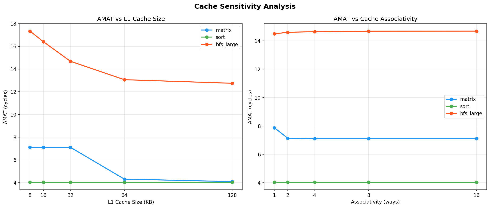

# Cache Hierarchy + Branch Predictor Simulator

A configurable multi-level cache hierarchy and branch predictor
simulator built in C++17. Simulates how a real CPU processes
memory accesses across 5 workloads with full sensitivity analysis.




## Live Dashboard
[View Interactive Dashboard](https://cache-sim-dashboard.lovable.app)

## GitHub
[github.com/Harshkataria-2004/cache-simulator](https://github.com/Harshkataria-2004/cache-simulator)

---

# Architecture

```text
┌─────────────────────────────────────────────────┐
│                    CPU Core                     │
└─────────────────┬───────────────────────────────┘
                  │ memory request
                  ▼
┌─────────────────────────────────────────────────┐
│ L1 Cache (32KB, 8-way, 64B, 4 cycles)           │
│ HIT → return data                               │
└─────────────────┬───────────────────────────────┘
                  │ MISS
                  ▼
┌─────────────────────────────────────────────────┐
│ L2 Cache (64KB, 8-way, 64B, 12 cycles)          │
│ HIT → return data                               │
└─────────────────┬───────────────────────────────┘
                  │ MISS
                  ▼
┌─────────────────────────────────────────────────┐
│ L3 Cache (512KB, 16-way, 64B, 36 cycles)        │
│ HIT → return data                               │
└─────────────────┬───────────────────────────────┘
                  │ MISS
                  ▼
┌─────────────────────────────────────────────────┐
│ DRAM (200 cycles)                               │
└─────────────────────────────────────────────────┘
```

**AMAT = H1 + M1 × (H2 + M2 × (H3 + M3 × t<sub>DRAM</sub>))**

---

# Features

## Cache Simulator

- 3-level cache hierarchy: L1 → L2 → L3 → DRAM
- 4 replacement policies: LRU, FIFO, LFU, Random
- Write-back and write-through support
- AMAT computation using real per-level latencies
- Trace-driven simulation (Valgrind + simple R/W format)
- Automated experiment pipeline with CSV output

## Branch Predictor

- 2-bit saturating counter predictor
- GShare predictor with global history register
- Side-by-side accuracy comparison

## Sensitivity Analysis

- AMAT vs L1 cache size (8KB → 128KB)
- AMAT vs associativity (1-way → 16-way)
- Identifies knee points and diminishing returns

---

# Key Results

## Cache Performance (LRU Policy)

| Workload | L1 Hit Rate | L2 Hit Rate | L3 Hit Rate | AMAT |
|----------|------------:|------------:|------------:|-----:|
| Sort | 99.98% | 0.00% | 0.00% | 4.04 cycles |
| Matrix | 74.78% | 92.63% | 98.03% | 7.77 cycles |
| BFS | 83.53% | 4.61% | 0.00% | 42.91 cycles |
| BFS Large | 79.61% | 63.03% | 55.66% | 15.84 cycles |
| Pointer Chase | 2.71% | 2.86% | 42.67% | 158.05 cycles |

## Policy Comparison (Matrix Workload)

| Policy | AMAT | vs LRU |
|--------|-----:|--------|
| Random | 6.89 cycles | **-11% faster** |
| LRU | 7.77 cycles | Baseline |
| FIFO | 7.86 cycles | +1.2% slower |
| LFU | 9.97 cycles | +28% slower |

## Branch Predictor Comparison

| Workload | 2-bit | GShare | Improvement |
|----------|------:|--------:|------------:|
| Matrix | 99.99% | 99.99% | Tie |
| BFS | 60.93% | 67.18% | +6.25% |
| Sort | 68.55% | 86.52% | **+17.97%** |

## Sensitivity Analysis

| Finding | Result |
|---------|--------|
| Matrix knee point | L1 = 64KB (AMAT drops from 7.11 → 4.04) |
| Associativity sweet spot | 2-way (beyond this: diminishing returns) |
| Sort insensitive to L1 size | Flat at 4.04 cycles from 8KB onwards |

---

# Key Insights

1. **Pointer chase is 39× slower than sort** (158 vs 4 cycles) —
   irregular access defeats the entire cache hierarchy.

2. **Random beats LRU by 11%** on matrix —
   LRU thrashing on strided access pattern; validated across
   10 independent trials.

3. **GShare beats 2-bit by 18%** on sort —
   global branch history captures correlation in
   comparison-heavy workloads.

4. **Matrix knee point at 64KB L1** —
   doubling L1 from 32KB → 64KB cuts AMAT almost in half;
   beyond 64KB gives zero benefit.

5. **Associativity beyond 2-way gives no benefit** for matrix —
   conflict misses eliminated at 2-way; more ways waste silicon.

---

# Build & Run

```bash
# Build cache simulator
g++ -std=c++17 -O2 -Iinclude \
    src/cache_level.cpp \
    src/cache_hierarchy.cpp \
    src/trace_reader.cpp \
    src/main.cpp -o cache_sim

# Build branch predictor
g++ -std=c++17 -O2 -Iinclude \
    src/branch_predictor.cpp \
    src/gshare_predictor.cpp \
    src/run_branch.cpp -o branch_sim

# Generate traces
python3 traces/gen_trace.py matrix    > traces/matrix_trace.txt
python3 traces/gen_trace.py bfs       > traces/bfs_trace.txt
python3 traces/gen_trace.py sort      > traces/sort_trace.txt
python3 traces/gen_trace.py pointer   > traces/pointer_trace.txt
python3 traces/gen_trace.py bfs_large > traces/bfs_large_trace.txt

# Run cache simulator
./cache_sim traces/matrix_trace.txt lru

# Run branch predictor comparison
./branch_sim

# Run all experiments
./experiment.sh

# Generate graphs
python3 visualize.py

# Run sensitivity analysis
python3 sensitivity.py
```

---

# Project Structure

```text
cache_simulator/
├── include/
│   ├── cache_block.h
│   ├── cache_level.h
│   ├── cache_hierarchy.h
│   ├── trace_reader.h
│   ├── branch_predictor.h
│   ├── gshare_predictor.h
│   └── policy.h
│
├── src/
│   ├── cache_level.cpp
│   ├── cache_hierarchy.cpp
│   ├── trace_reader.cpp
│   ├── branch_predictor.cpp
│   ├── gshare_predictor.cpp
│   ├── main.cpp
│   ├── run_branch.cpp
│   └── cache_sweep.cpp
│
├── traces/
│   ├── gen_trace.py
│   └── gen_branch_trace.py
│
├── visualize.py
├── sensitivity.py
├── experiment.sh
├── run_trials.sh
├── results.csv
├── results.png
├── sensitivity.png
└── README.md
```

---

# Default Configuration

| Level | Size | Ways | Block | Latency |
|------|------|-----:|------:|--------:|
| L1 | 32 KB | 8 | 64 B | 4 cycles |
| L2 | 64 KB | 8 | 64 B | 12 cycles |
| L3 | 512 KB | 16 | 64 B | 36 cycles |
| DRAM | — | — | — | 200 cycles |

---

# Resume Bullets

- Built a **3-level cache hierarchy simulator** in C++17 with LRU,
  FIFO, LFU, and Random replacement policies; benchmarked 5 workloads
  showing pointer chase is **39× slower** than sort
  (158 vs 4 cycles AMAT).

- Implemented **GShare branch predictor** outperforming a 2-bit
  predictor by **18%** on the sort workload by exploiting
  global branch history.

- Discovered **Random beats LRU by 11%** on the matrix workload due
  to LRU thrashing; validated across 10 independent trials with a
  fixed random seed.

- Conducted **sensitivity analysis** revealing a matrix knee point at
  **64KB L1** and diminishing returns beyond **2-way associativity**.

---

# Threats to Validity

- Synthetic traces may not fully represent real program behavior.
- Small workload sizes limit statistical significance for some results.
- Single architecture configuration; results may vary on different cache geometries.

---

# References

1. Hennessy & Patterson — *Computer Architecture: A Quantitative Approach*
2. Belady (1966) — *A Study of Replacement Algorithms for Virtual Storage*
3. McFarling (1993) — *Combining Branch Predictors* (GShare paper)
4. Mattson et al. (1970) — *Evaluation Techniques for Storage Hierarchies*

---

# Tech Stack

**C++17 | Python 3 | matplotlib | Bash | WSL**

---

# Author

**BITS Pilani Hyderabad**  
**MTech Computer Science**  
**2025**