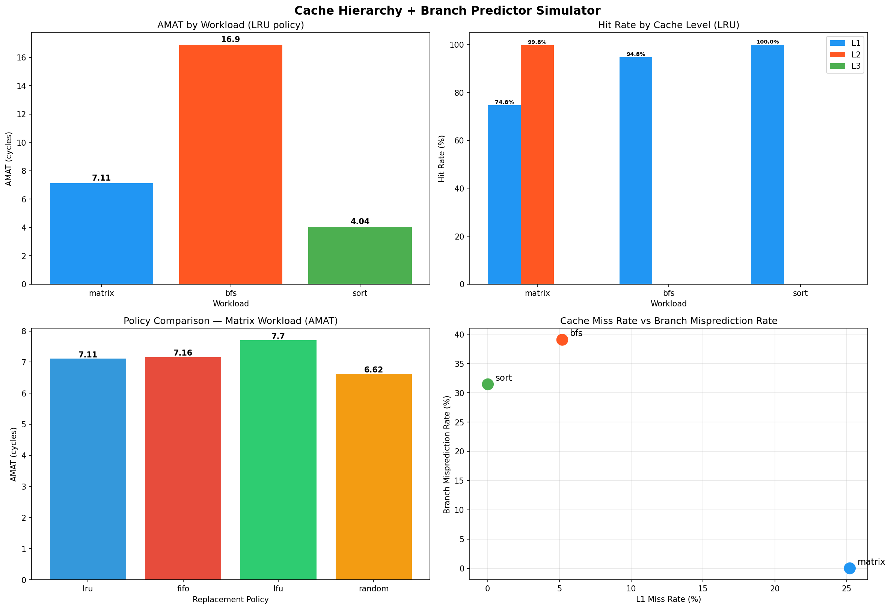

# Cache Hierarchy + Branch Predictor Simulator

A configurable multi-level cache hierarchy and branch predictor
simulator built in C++17. Simulates how a real CPU processes memory
accesses and branch instructions across 3 workloads.



## Live Dashboard
[View Interactive Dashboard](https://cache-sim-dashboard.lovable.app)

---

## What this project is about

When a CPU needs data it checks caches before RAM:
CPU → L1 (4 cycles) → L2 (12 cycles) → L3 (36 cycles) → RAM (200 cycles)

This simulator mimics that journey and measures performance.

---

## Key Results

| Workload | L1 Hit Rate | L2 Hit Rate | AMAT | Branch Accuracy |
|----------|-------------|-------------|------|-----------------|
| Matrix   | 74.78%      | 99.85%      | 7.11 cycles | 100.00% |
| BFS      | 94.80%      | 0.00%       | 16.90 cycles | 60.94% |
| Sort     | 99.98%      | 0.00%       | 4.04 cycles | 68.55% |

## Policy Comparison (Matrix Workload)

| Policy | AMAT        |
|--------|-------------|
| LRU    | 7.11 cycles |
| FIFO   | 7.16 cycles |
| LFU    | 7.70 cycles |
| Random | 6.62 cycles |

---

## Key Insights

1. **L2 saves matrix** — Matrix overflows L1 (74.78%) but L2
   catches 99.85% of all L1 misses — hierarchy working as designed

2. **BFS bypasses hierarchy** — Irregular pointer-chasing sends
   missed data straight to DRAM, L2 and L3 unused

3. **Random beats LRU** — Random (6.62 cycles) outperforms LRU
   (7.11 cycles) on matrix — theory doesn't always win in practice

4. **Cache and branch are correlated** — Workloads with irregular
   memory access also have unpredictable branches

---

## Features

- 3-level cache hierarchy: L1 → L2 → L3 → DRAM
- 4 replacement policies: LRU, FIFO, LFU, Random
- Write-back and write-through support
- AMAT computation
- 2-bit saturating counter branch predictor
- Trace-driven simulation (Valgrind + simple R/W format)
- Automated experiment pipeline with CSV + graphs

---

## Build & Run

```bash
# Build cache simulator
g++ -std=c++17 -O2 -Iinclude \
    src/cache_level.cpp \
    src/cache_hierarchy.cpp \
    src/trace_reader.cpp \
    src/main.cpp -o cache_sim

# Build branch predictor
g++ -std=c++17 -O2 -Iinclude \
    src/branch_predictor.cpp \
    src/run_branch.cpp -o branch_sim

# Generate traces
python3 traces/gen_trace.py matrix > traces/matrix_trace.txt
python3 traces/gen_trace.py bfs    > traces/bfs_trace.txt
python3 traces/gen_trace.py sort   > traces/sort_trace.txt

# Run
./cache_sim traces/matrix_trace.txt lru
./branch_sim

# All experiments
./experiment.sh

# Graphs
python3 visualize.py
```

---

## Default Configuration

| Level | Size   | Ways | Block | Latency   |
|-------|--------|------|-------|-----------|
| L1    | 32 KB  | 8    | 64 B  | 4 cycles  |
| L2    | 256 KB | 8    | 64 B  | 12 cycles |
| L3    | 4 MB   | 16   | 64 B  | 36 cycles |
| DRAM  | —      | —    | —     | 200 cycles|

---

## Project Structure

cache_simulator/
├── include/
│ ├── cache_block.h
│ ├── cache_level.h
│ ├── cache_hierarchy.h
│ ├── trace_reader.h
│ ├── branch_predictor.h
│ └── policy.h
├── src/
│ ├── cache_level.cpp
│ ├── cache_hierarchy.cpp
│ ├── trace_reader.cpp
│ ├── branch_predictor.cpp
│ ├── main.cpp
│ └── run_branch.cpp
├── traces/
│ ├── gen_trace.py
│ ├── gen_branch_trace.py
├── visualize.py
├── experiment.sh
├── results.csv
├── results.png
└── README.md